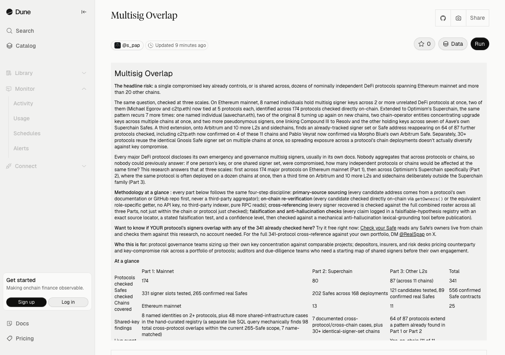

# multisig-overlap

**The headline risk:** a single compromised key already controls, or is shared across, dozens of nominally independent DeFi protocols spanning Ethereum mainnet and more than 20 other chains.

The same question, checked at three scales:

- **Ethereum mainnet**: 8 named individuals hold multisig signer keys across 2 or more unrelated DeFi protocols at once, identified across 194 protocols checked directly on-chain. Two of them, Michael Egorov and c2tp.eth, are now tied at 5 protocols each.
- **Optimism's Superchain**: the same pattern recurs 9 more times, with one named individual (aavechan.eth), two of the original 8 turning up again on new chains, two chain-operator entities concentrating upgrade keys across multiple chains at once, two more pseudonymous signers, one linking Compound III to Resolv and the other holding keys across seven of Aave's own Superchain Safes, plus a newly-confirmed case linking Kelp DAO and Stader Labs (shared founders, expected) and, from 2026-09-21, the keys that govern the Celo chain itself also holding a liquid-staking token deployed on it.
- **Arbitrum and 10 more L2s and sidechains**: an already-tracked signer set or Safe address reappears on 66 of 94 further protocols checked, including c2tp.eth now confirmed on 4 of these 11 chains.

Separately, 30+ protocols reuse the identical Gnosis Safe signer set on multiple chains at once, so spreading exposure across a protocol's chain deployments doesn't actually diversify against key compromise.

Live dashboard, click through for the interactive version.

## Contents

- [Methodology at a glance](#methodology-at-a-glance)
- [Who this is for](#who-this-is-for)
- [Get notified](#get-notified)
- [At a glance](#at-a-glance)
- [Part 1: Mainnet](#part-1-mainnet-194-protocols-8-named-identities)
- [Part 2: Superchain](#part-2-superchain-99-protocols-9-signer-sharing-cases)
- [Part 3: Arbitrum and other L2s](#part-3-arbitrum-and-other-l2s-98-protocols-66-pattern-matches)
  - [Arbitrum](#arbitrum)
  - [Polygon](#polygon)
  - [BNB Chain](#bnb-chain)
  - [Avalanche](#avalanche)
  - [zkSync Era](#zksync-era)
  - [Linea](#linea)
  - [Scroll](#scroll)
  - [Berachain](#berachain)
  - [Mantle](#mantle)
  - [Blast](#blast)
  - [Sonic](#sonic)
- [Access to the tool](#access-to-the-tool)
- [Disclaimer](#disclaimer)
- [About](#about)
- [License](#license)

## Methodology at a glance

Every part of this research, across all three scales below, follows the same four-step discipline:

- **Primary-source sourcing.** Every candidate address comes from a protocol's own documentation or GitHub repository first, never a third-party aggregator or press citation.
- **On-chain re-verification.** Every candidate is checked directly on-chain via `getOwners()` (or the equivalent role-specific getter): no API key, no third-party indexer, pure RPC reads against a public node for the relevant chain.
- **Cross-referencing.** Every signer recovered is checked against the full combined roster this research already has on record across all three Parts, not just within the chain or protocol just checked.
- **Falsification and grounding checks.** Every identity or cross-reference claim is logged in a falsifiable-hypothesis registry with an exact source locator, a stated falsification test, and a confidence level, then checked against a mechanical grounding lexical-grounding tool before publication.

Each Part's own Method section below states only what's specific to that Part: how many protocols and chains, and any edge cases this general method doesn't cover.

## Who this is for

Protocol governance teams sizing up their own key concentration against comparable projects. Depositors, insurers, and risk desks pricing counterparty and key-compromise risk across a portfolio of protocols. Auditors and due-diligence teams who need a starting map of shared signers before their own engagement. Teams evaluating whether to license this method for their own protocol or portfolio. Every finding below cites its own primary source so it can be independently re-checked, not taken on faith.

## Get notified

No account needed on this repo: click Watch, then Custom, then Releases only, on this repo's GitHub page. Every research pass gets tagged as a release, title and body taken straight from that pass's own commit message, for a per-pass update feed. On Dune, star the dashboard to keep it in your own list, or set a scheduled alert on the query for a ping the moment a tracked Safe's owner set actually changes on-chain, not just when this repo gets updated.

## At a glance

| | Part 1: Mainnet | Part 2: Superchain | Part 3: Other L2s | Total |
|---|---|---|---|---|
| Protocols checked | 194 | 99 | 98 (across 11 chains) | 391 |
| Safes checked | 332 signer slots tested, 266 confirmed real Safes | 254 distinct addresses across 242 deployments, 295 Gnosis Safe readings plus 11 custom-multisig readings | 177 candidates tested, 167 confirmed real Safes | 737 confirmed multisig contracts |
| Chains covered | Ethereum mainnet | 13 | 11 | 25 |
| Shared-key findings | 8 named identities on 2+ protocols, plus 48 more shared-infrastructure cases | 9 documented cross-protocol/cross-chain cases, plus 41+ identical-signer-set chains | 66 of 98 protocols extend a pattern already found in Part 1 or Part 2 | |
| Live event replay | Yes, on-chain | Yes, on-chain (8 of 13 chains, plus Ethereum mainnet for L1 governance); the three custom multisigs found in pass 36 are deliberately outside it, see Part 2 | Yes, on-chain (11 of 11 chains) | |

**Protocols referenced include:** Aave, Curve Finance, Compound III, Lido, Balancer, Yearn, Convex, Morpho Blue, Frax Finance, Chainlink Data Feeds, 1inch, and Beefy Finance.

**Confidence & match vocabulary:**
- **Confirmed identity**: a named individual or entity, backed by a primary-source citation (a protocol's own docs, GitHub, or governance forum post) tying that specific address to that name.
- **High-confidence identity**: strong circumstantial evidence (role, context, or a single indirect signal) rather than a direct name-to-address citation, flagged inline wherever it applies.
- **Pseudonymous**: the address recurs across protocols but no primary source ties it to a real name, so it's reported at address or ENS level only.
- **Identical signer set**: two Safe contracts at different addresses share the exact same list of owner addresses.
- **Same literal Safe address**: the identical contract address is deployed and live on more than one chain.
- **Partial overlap**: only some signers are shared between two Safes, not the full set.

**Want this method run on your protocol, or a custom research pass? License it: DM [@RealSpap](https://x.com/RealSpap) on X.**

## Access to the tool

The verification method behind this research is available under a commercial license, not published in this repository. The findings below were produced with it and are independently reproducible by anyone with the same access; this repo documents the results, not the mechanism. Want a free preview first? [Check your Safe](https://realspap.github.io/tools/check-your-safe.html) reads any Safe's owners live from chain, in your browser, and checks them against the nine identities already named in this research, no account needed. Reach out via [Spap on X](https://x.com/RealSpap) for licensing.

## Disclaimer

This report presents an independent, factual analysis of publicly available on-chain data (smart contract code, multisig signer sets, governance transactions) as of the date noted in each Part's own Status/Method section below; it is not updated automatically as those signer sets and configurations change after publication.

Full disclaimer, licensing, and program-wide notes: [methodology](https://realspap.github.io/methodology.html).

## Part 1: Mainnet (194 protocols, 8 named identities)

### Method

194 protocols' multisig contracts (Gnosis Safe) checked directly on-chain: 375 candidate addresses tested, 308 confirmed as real Safe contracts. Scope grew from an original 41-protocol pilot to 194 protocols across 31 research rounds, each adding several more protocols and re-running the full cross-reference against every signer already on record.

### Findings

8 addresses hold signer power on 2+ independent protocols, sorted by how many protocols each one touches. All 8 are identified by name or known pseudonym, each backed by a primary-source citation:

| Rank | Identity | Protocols | Reach | Role |
|---|---|---|---|---|
| 1 | **Michael Egorov** | Abracadabra + Yearn + Prisma + Threshold Network + Usual Money | 5 protocols | Founder of Curve Finance |
| 1 | **c2tp.eth** | Convex (his own protocol) + Prisma + Votium + Curve Finance's own Emergency DAO + Resupply | 5 protocols | Pseudonymous creator of Convex Finance |
| 3 | **Sam Kazemian** | Frax (his own protocol) + Prisma + Fraxtal's L1 chain-governance Safe | 3 protocols | Founder of Frax Finance |
| 3 | **Matthew Graham** | Gearbox + TokenLogic (his own service, incl. 1 of GHO Stablecoin's role Safes) | 3 protocols | Founder of TokenLogic |
| 5 | **Ernesto Boado** (BGD Labs) | Lido + Balancer | 2 protocols | Infrastructure/security provider working with multiple protocols |
| 5 | **Pablo Veyrat** | Angle (his own protocol) + Morpho | 2 protocols | Founder of Angle Protocol |
| 5 | **Julien Bouteloup** | Abracadabra + StakeDAO (his own protocol) | 2 protocols | Founder of StakeDAO / Rekt News, early Curve team |
| 5 | **"Tommy"** | Votium (his own protocol) + Convex | 2 protocols | Known representative of Votium |

Egorov's and c2tp.eth's keys now each touch 5 independent protocols at once, tied for the widest documented mainnet reach of any named individual in this research. A single compromised key for either one puts several unrelated protocols' funds at risk simultaneously, not one.

This 2026-09-11 resync (scope grew 132→171 protocols) surfaced two reach increases among the original 8, both newly-tracked protocols rather than a change in who holds which key: Sam Kazemian's Frax-founder address is also a signer on Fraxtal's own L1 chain-governance Safe (ProxyAdminOwner), and Matthew Graham/TokenLogic's address now also sits directly on one of GHO Stablecoin's role-specific Safes, its own TokenLogic entity Safe (`0x9DE1d45e2786b03498289959203F25b29B4D1193`), confirmed via a fresh `getOwners()` call on 2026-09-14; that same TokenLogic entity Safe is, in turn, one of three entity-Safes (alongside AaveLabs' and LlamaRisk's) that jointly own GHO's RiskCouncil Safe, so his reach touches RiskCouncil only indirectly through that nested Safe, not as a direct on-chain owner of it.

Three of the eight (Egorov, c2tp, Kazemian) sit together on Prisma Finance's emergency multisig, a deliberate, publicly disclosed design choice by Prisma to recruit established protocol founders for credibility, not a hidden concentration. The other five are more organic: independent protocols with no obvious institutional link to each other. Sam Kazemian's identity was originally flagged as role-inference only; Prisma Finance's own docs (docs.prismafinance.com/governance/admin-functions/emergency-multisig, read 2026-09-13 via an archived snapshot after the live domain returned a DNS failure) name "Sam Kazemian - Frax Finance" explicitly among the multisig's 9 named members, and this address is the only Frax-affiliated signer among the Safe's on-chain owners, corroborating the identity with a primary-source name citation rather than role-inference alone.

Matthew Graham and TokenLogic reappear in Part 2: the same address also sits on three of Aave's Superchain Safes across Ink and Celo. See Part 2 below for the full cross-chain picture.

A 2026-09-11 same-day follow-up added three new mainnet protocols, none with a new named identity but each with a new pseudonymous signer-overlap case:

| Protocol | What was found |
|---|---|
| **Spiko** (RWA tokenized money-market funds) | New protocol added to scope, no overlap case yet attached |
| **DeFiSaver** (DeFi position automation) | Its admin signer is also one of Aave's own official Governance Guardian signers |
| **Veda** (fka Se7en Seas, the BoringVault infrastructure operator behind ether.fi's Liquid vaults and others) | Two vault-governance signers are also EtherFi and LombardFinance signers respectively, 2 of 5 signers shared on the Lombard case |

A 2026-09-13 addition covers Gnosis Chain's canonical bridges: the 8-of-15 Bridge Governor Safe that is both the upgrade owner and the admin owner of the xDai Bridge and the OmniBridge on Ethereum (~$271M TVL). No new mainnet-internal overlap, but one of its 15 owners is aavechan.eth, already tracked below on QiDao/Mai Finance and Aave Safes, now confirmed on a third unrelated protocol; Gnosis Chain's own docs list the Aave-Chan Initiative as one of the 15 governor organizations, so the seat is disclosed, the cross-protocol aggregation is what's new.

Two later additions round out the rollup coverage: Taiko Alethia's `admin.taiko.eth` Safe (4-of-6, added 2026-09-16) and Hop Protocol's L1 bridge-governance Safe (2-of-3). Neither shares a signer with any other tracked protocol.

The 2026-09-19 round added 18 protocols in one pass, mostly the teams that curate lending vaults on Morpho and Euler. Their addresses come from the two protocols' own official registries (Morpho's curator API and Euler's `euler-labels` repo), and every Safe was read identically on two independent public RPCs, with the vault role (`owner()`, `curator()`, `guardian()`) re-read on-chain too.

| Protocol | What was found |
|---|---|
| **Gauntlet, RockawayX, Armitage by Wintermute, Clearstar, Hakutora, Hyperithm, KPK, MEV Capital, SwissBorg, Re7 Labs** (vault curators) | Real multisigs (2-of-3 up to 5-of-8), no signer shared with any other tracked protocol |
| **Steakhouse Financial + Waterline** | 10 signers shared between the two brands' Safes. Waterline vaults carry Steakhouse's `0xbeef` address prefix and are served on Steakhouse's own app, so this is one team under two names, not two independent curators |
| **Avantgarde** | One vault-owner signer also sits on Enzyme's Dispatcher owner Safe. Avantgarde is the company that builds Enzyme, so the link is disclosed staff, not a hidden concentration |
| **Sentora** (curator of the main PYUSD and RLUSD vaults, ~$1.4B on Ethereum) | The owner and curator of the ~$441M Paypal USD Main vault are each a 1-of-1 Safe held by a single wallet. The vault's 3-day timelocks on adding markets and its locked withdrawal gates limit what that single key can do alone |
| **Boba Network, ZeroLend, Swaap, Keyring** | New to mainnet scope (Boba's L1 upgrade key, the others' Euler-listed Safes), no overlap found |

The L1 governance Safes of World Chain, Celo, BOB, Soneium, Mode and Zora were checked in the same pass but are already covered in Part 2, so they are not counted twice here.

Aave's own Governance Guardian Safe, already tracked cross-chain in Part 2 and Part 3, was added to this mainnet scope for the first time this round specifically so the DeFiSaver overlap shows up in the live query below, not just in the hand-curated registry.

Beyond the 8 named identities, this research has surfaced 50 more shared-infrastructure or signer-overlap cases on mainnet, most of which turn out to be Safes already tracked in Part 2 or Part 3 resolving identically on Ethereum too.

- **48**: the hand-curated, individually-documented count in the registry below.
- **98**: total cross-protocol overlaps the live SQL query mechanically finds on its own within the current 266-Safe scope, 7 of which are name-matched to one of the 8 identities above. The difference is cases the live query catches structurally, such as an identical Safe reused across chains, that the hand-curated registry also documents individually with its own citation.
- **Full list, live**: the Part 1 query results table on [dune.com/s_pap/multisig-overlap](https://dune.com/s_pap/multisig-overlap) (query results directly at [dune.com/queries/8632314](https://dune.com/queries/8632314)).

### Live verification

The table above replays the actual on-chain event history of every Safe contract tracked in the current 194-protocol scope, recomputing current ownership fresh every time it runs. This 2026-09-11 resync closed the gap that used to exist between the live query (previously 65 Safes) and the full research corpus. 2 of the 8 identities (Julien Bouteloup's second seat and c2tp.eth's Convex seat) don't reproduce through live event replay, because they sit on Safe versions old enough their creation transactions don't log the data a pure event-based rebuild needs; both are confirmed instead by a direct `getOwners()` read, independently cross-checked against the relevant transaction logs on Etherscan.

Live query: [dune.com/s_pap/multisig-overlap](https://dune.com/s_pap/multisig-overlap).

**Get notified**: see [Get notified](#get-notified) above.

### Open data (Mainnet)

The live query's own result table is queryable directly through [Dune's Query API](https://docs.dune.com/api-reference/api-overview) by anyone with a free Dune API key, no scraping needed: pull the same 8 identities the same way this page does, recomputed fresh on every call.

**Full scope manifest**: [`data/full-scope-manifest-mainnet.csv`](data/full-scope-manifest-mainnet.csv) lists every one of the 375 candidate addresses actually checked on Ethereum mainnet (308 confirmed as real deployed Safe contracts), not just the identities and overlap cases flagged as findings above, so anyone can confirm the findings are the complete result of the screen rather than a cherry-picked subset.

### What's checked next (Mainnet)

194 protocols is a growing survey, not a finished one. Open a GitHub Issue on this repo to suggest the next protocol to check; a thumbs-up on an existing suggestion counts as a vote (this sets research priority only; checks are still run under the same licensed method, not opened to contributors). The Superchain-specific follow-up already covers 80 more protocols, and a third extension covers 87 more across Arbitrum and 10 other L2s and sidechains: see Part 2 and Part 3 below.

### Verification

Every claim in this research follows the same verification discipline described in [Methodology at a glance](#methodology-at-a-glance) above. The mainnet registry holds 57 rows: the 8 identities, 1 correction (see Caveats below), and 48 shared-infrastructure or signer-overlap cases. Of the 9 hand-researched rows (the 8 identities plus the correction), all 9 are at High confidence (Sam Kazemian's link to Frax was upgraded from Medium on 2026-09-13, once Prisma's own docs corroborated it, see above); the 48 shared-infrastructure cases are all independently sourced and at High confidence too, and are mechanically re-confirmed against the live on-chain query. Since 2026-09-19 the registry also carries one verification row per newly added protocol (18 rows), each at High confidence and each pointing to its raw two-RPC evidence.

### Status

Last verified: 2026-09-19.

194 protocols checked, not a finished survey. Scope has grown from an original 41-protocol pilot across 31 research rounds, each one adding new protocols, resolving a previously parked case, or re-running the full cross-reference against every signer already on record.

### Caveats (Mainnet)

- One of the 8 identities (Julien Bouteloup's second seat) and one seat behind another (c2tp.eth's Convex seat) don't reproduce through live event replay, because they sit on Safe versions old enough that their creation transactions don't log the data a pure event-based rebuild needs; both are confirmed by a direct `getOwners()` read instead. See Live verification above.
- 194 protocols is a growing survey, not a finished one (see What's checked next). A protocol not listed here hasn't been checked, not confirmed clean.
- Three of the eight identified signers (Egorov, c2tp, Kazemian) sit together on Prisma Finance's multisig by Prisma's own deliberate, publicly disclosed design choice to recruit established founders for credibility, not a hidden concentration; treating that case the same as the other five would overstate how coordinated the overlap actually is.
- One candidate address needed a correction from a sibling project in this research program. Ethena's `Owner_Multisig_3of11` is a real, confirmed 10-signer Safe, but an independent check in a sibling research project found it does not match the actual `owner()` of either EthenaMinting V2 or the USDe token (both a 24-hour Timelock instead), nor EthenaMinting V1's actual owner (a separate 5-of-10 Safe). The Safe is real; what it currently controls at Ethena, if anything, is unconfirmed.

## Part 2: Superchain (99 protocols, 9 signer-sharing cases)

Extension of Part 1 to Optimism's Superchain (OP Mainnet, Base, Mode, Unichain, Ink, Soneium, Lisk, Celo, Zora Network, World Chain, Fraxtal, Derive Chain, and BOB so far). Part 1 asks "does the same person hold emergency keys on multiple, unrelated protocols at once?" This part asks a Superchain-specific variant: "does the same signer set control a protocol's admin multisig on multiple chains at once, and does anyone share keys across genuinely different Superchain protocols?"

### Method

254 distinct multisig addresses across 242 protocol/chain deployments, checked directly on-chain (295 Gnosis Safe readings plus 11 readings of custom, non-Gnosis multisigs) (see [Methodology at a glance](#methodology-at-a-glance) above). This also covers who controls the 13 tracked chains themselves at the L1 (Ethereum mainnet) level, not just the dapps deployed on them: a real Gnosis Safe was confirmed as the ProxyAdminOwner on all 13, with World Chain's separate SystemConfigOwner the sole exception, a bare EOA rather than a Safe.

**Pass 35 (2026-09-17) added 4 new protocols** (LI.FI, Threshold Network/tBTC, Kelp DAO rsETH, Coinbase cbETH) plus extensions of 5 already-tracked protocols (Velodrome Superchain, Compound III, Morpho Blue, Lido Emergency Brakes) onto more chains, and Pass 34 (2026-09-16) caught up Pendle's governance/dev/treasury Safes, previously missing from live execution. See Findings below for the one new cross-protocol case this pass surfaced (Kelp DAO / Stader Labs).

**Pass 36 (2026-09-21) added 11 new protocols and fixed a blind spot in the method.** Until this pass the check only ever asked a Gnosis Safe question (`getOwners()`), so any protocol whose multisig is not a Gnosis Safe read as "no multisig here" and was dropped. Two families turn out to matter: LayerZero Labs' **OneSig** (`getSigners()` / `threshold()`), used by both LayerZero and Stargate, and the **MultiSig.sol** of Celo's own `staked-celo` repository (`getOwners()` / `required()`). Stargate had actually been *excluded* on those grounds in an earlier pass; that exclusion is now lifted and recorded as a correction rather than quietly dropped. The new protocols this pass: LayerZero, Stargate, Spark's Liquidity Layer, Ionic Protocol, the vault-curator layer on Morpho (Gauntlet/Extrafi XLend, Steakhouse/Grove, Pangolins, Moonwell, Yearn/Origin on Base and Re7 Labs on World Chain), Bedrock, Mento and StakedCelo, plus Chainlink CCIP on Base and Exactly Protocol on Optimism resolved late in the same pass.

Those last two carry a reserve that is stated here rather than buried: their `PROPOSER_ROLE` holders came out of an event replay that could not scan every block range on free public endpoints (4208 ranges missed for CCIP, 16468 for Exactly). Every address the replay produced was then re-confirmed with a direct `hasRole()` call on two endpoints, which reads current state instead of replaying history, so each holder listed is a confirmed positive. The list of holders is not guaranteed complete, and it is labelled that way in the registry.

A second correction happened inside the same pass and is worth stating plainly, because it is the kind of mistake that normally never reaches a reader. A first check concluded that none of the new signer sets overlapped anything already tracked. That check was wrong by construction: it compared the new signers against the *Safe addresses* already on record rather than against the *signers behind them*, so a signer-level overlap was structurally invisible to it. The project's own live cross-reference, which does compare signer to signer, surfaced one immediately, and it is finding 8 below.

### The exposure leaderboard

Every case below is one of the seven findings detailed further down, sorted by how many Safe deployments a single signer, or a single shared Safe, actually touches. These are the numbers already stated in the findings below, just gathered in one place first.

| Rank | Who | Reach | Category |
|---|---|---|---|
| 1 | Matthew Graham / TokenLogic | 4 protocols, 3 chains, 6 Safes (across this project and Part 1) | Cross-protocol individual |
| 2 | `0x8f02b4a4...` (Pablo Veyrat) | 2 protocols (Morpho Blue, Angle), 6 Superchain Safes, plus both protocols' Ethereum mainnet Safes | Cross-protocol individual |
| 3 | Optimism Foundation / Security Council Safe | 5 of 13 Superchain chains share the identical ProxyAdminOwner Safe | Chain governance |
| 4 | Conduit (RaaS operator) | Signers recur across at least 4 nominally independent chains' own governance Safes | Chain governance |
| 5 | `aavechan.eth` | 3 protocols (QiDao/Mai Finance, Aave, plus Gnosis Chain's canonical bridges on Ethereum mainnet), 4 Safe deployments | Cross-protocol individual |
| 6 | `0x9A73D57B...` | 2 protocols (Compound III, Resolv), 3 Safe deployments | Cross-protocol individual |
| 7 | `0xb291232F...` | 1 protocol (Aave), 7 Safe deployments across 5 chains (Protocol Guardian on Optimism, Base, Soneium, and Celo; AFC, Budget Incentive, Ahab, and Alc Safes on Ink and Celo) | Single-protocol concentration |
| 8 | cLabs signer set | 8 keys that own Celo's own L1 SystemConfig also make up, in full, the 6-key multisig that owns StakedCelo on Celo | Chain governance meets dapp |
| 9 | `0x52a8305F...` (Spark) | 1 protocol (Spark), signer on 6 of its 7 Safes across Base, Optimism, Unichain and World Chain, including a 1-of-2 | Single-protocol concentration |
| 10 | LayerZero OneSig committee | 7 keys, 5-of-7, identical on 7 of the 13 tracked chains, owner of the EndpointV2 every omnichain app on those chains routes through | Single-protocol concentration |

### Findings

**Five separate cases of one signer holding real power across genuinely unrelated protocols:**

1. `0x8f02b4a44Eacd9b8eE7739aa0BA58833DD45d002` is an owner of both Morpho Blue's governance Safe (now on **Base, World Chain, Fraxtal, Optimism, Ink, Unichain, Mode, and Lisk, 8 chains**, up from 3) and Angle Protocol's Guardian Safe (**Optimism, Base, and Celo**), eleven separate Superchain Safe deployments in total. Morpho and Angle have no institutional relationship. The same address also sits on both protocols' Ethereum mainnet Safes (already on record in Part 1 for Angle), so a single compromised key here threatens Morpho and Angle simultaneously, across mainnet and eleven Superchain deployments. It's identified with **high confidence as Pablo Veyrat, co-founder of Angle Protocol and Merkl**, named explicitly with this exact address by Morpho Association's own governance forum post proposing him as a multisig signer.

1bis. **Kelp DAO rsETH and Stader Labs** (new, 2026-09-17) share 2 signers on their respective Base and Optimism Admin/ETHx Safes. Context found before presenting this as notable: Kelp and Stader share the same founding team, a link already documented on mainnet and elsewhere in this project's Superchain data, so this extends an expected relationship rather than surfacing a new institutional link.

2. **Matthew Graham / TokenLogic**, already named in Part 1 as an owner of both Gearbox's Technical Multisig and TokenLogic's own Safe on Ethereum, is now also confirmed as an owner of three of Aave's role-specific Safes (Merkl rewards distribution, a "Robot Guardian" automation role, and TokenLogic's own execution Safe), deployed at the identical addresses on both Ink and Celo. A second TokenLogic team member from that same Ethereum Safe is confirmed alongside him on both chains. Combined with the GHO Stablecoin Safe confirmed directly in Part 1 above, this is the widest documented footprint of any named individual across this research: four protocols, three chains, six Safes.
   *What this means in practice: this is the single widest blast radius identified across this research. A key held by one small team now touches Gearbox, TokenLogic, Aave, and GHO Stablecoin at once.*

3. **aavechan.eth**, an ENS-verified, Basescan-labeled Aave ecosystem operator, is confirmed as an owner of both QiDao/Mai Finance's Base and Fraxtal Guardian Safes and Aave's Celo "Masiv" Safe: three separate Safe deployments across two independently-run protocols with no institutional relationship, caught by the script's own cross-reference logic rather than assumed. A 2026-09-13 mainnet round found the same address as one of the 15 owners of the 8-of-15 Bridge Governor Safe that owns both of Gnosis Chain's canonical bridges on Ethereum (xDai Bridge and OmniBridge), a third unrelated protocol; Gnosis Chain's own docs list the Aave-Chan Initiative as one of the 15 governor organizations, so the seat is disclosed, the cross-protocol aggregation is what's new.

4. `0x9A73D57BB1fB280C5672A13f655675De25F13b70` is an owner of both Compound III's Pause Guardian Safe, now confirmed on **Base, Optimism, and Unichain** (up from Base alone), and Resolv's Base and Soneium Token Owner Safes. Compound III and Resolv have no institutional relationship. Found by the same cross-reference logic once Resolv's Safes were added to the registry, not assumed in advance.

8. **StakedCelo and the Celo chain's own governance** (new, 2026-09-21). The 6 keys of StakedCelo's owner multisig on Celo are, all six of them, inside the 8-key Safe `0x9Eb44Da23433b5cAA1c87e35594D15FcEb08D34d` that owns Celo's own `SystemConfig` on Ethereum L1, a Safe already tracked here as case 5's neighbour. Context searched for before calling this notable, and found: cLabs is Celo's core development company and operates both, so the link is institutionally expected rather than a hidden relationship. What is not symmetric is the cost of using those keys. Moving Celo's L1 chain parameter needs 6 signatures out of 8. Moving StakedCelo needs 3 out of the same people, behind a 4-day delay. The project's documentation describes that multisig as 3-of-5; read live on two independent endpoints it is 3-of-6.
   *Why this only surfaces now: StakedCelo's owner is not a Gnosis Safe, so before pass 36 the check never read its signers at all.*

**Three more cases of concentrated control, but of a different kind: chain-level governance concentration (cases 5 and 6) and single-protocol concentration (case 7), rather than one signer spanning unrelated protocols:**

5. **5 of the 13 tracked chains (Optimism, Mode, Ink, Soneium, Zora) delegate their entire L1 chain-governance authority, the ProxyAdminOwner role able to upgrade nearly any part of that chain's L1 bridge/rollup contracts, to the identical Gnosis Safe**: a nested 2-of-2 between the Optimism Foundation and the Security Council. Unichain's own separate Safe shares 2 of its 3 signers with that same pair, but it is a distinct Safe, not the identical one. This isn't one protocol deployed five times: these are five independently branded chains, several run day-to-day by entirely separate companies, that have each chosen to hand core upgrade rights to the same small, centrally Optimism-Foundation-operated group.
   *What this means in practice: this is the single largest concentration in the dataset. One Safe's signers can upgrade the core L1 contracts of 5 of the 13 chains this project tracks, with Unichain's own separate Safe sharing most of the same signers on top of that.*

6. **Conduit**, the Rollup-as-a-Service operator behind Mode and Derive Chain, controls both chains' core chain-governance role through the identical Safe. Four of that Safe's 11 signers individually also sit on Zora Network's and/or BOB's own separate chain-governance Safes: the same infrastructure-provider personnel holding upgrade rights across at least four nominally independent chains at once.

7. `0xb291232F480F41c75802C4a60F1D2AC03404Afef` is a pseudonymous signer confirmed on Aave's own core Protocol Guardian Safe on four chains (Optimism, Base, Soneium, and Celo) and also on a separate 3-person cluster controlling four of Aave's Ink and Celo role-specific Safes (AFC_Safe, Budget_Incentive_Safe, Ahab_Safe, and Alc_Safe): seven distinct Safe formations across five chains, all within Aave alone. Unlike the four cross-protocol cases above, this one never leaves a single protocol: it's one Aave ecosystem operator trusted with keys across nearly every layer of Aave's own Superchain footprint at once.

Beyond those cases, the sample also confirms a **Superchain-specific pattern**: several protocols run the exact same signer set across multiple chains at once.

Show all 49 cases

| Protocol | What was found |
|---|---|
| **LI.FI** (new) | Its Timelock Proposer/Admin Safe (3-of-6) is deployed with the identical 6 signers on 11 of the 13 tracked Superchain chains (all but Zora and Derive), owner of the LiFiDiamond behind a 3-hour timelock; the same trousseau also covers all 11 of Part 3's chains, 22 chains total |
| **Velodrome Superchain** (extended) | Its Pool_Admin/Pauser role, already tracked on Optimism and Base as Aerodrome, is now confirmed with the identical trousseau on Mode, Celo, Ink, and Unichain too |
| **Threshold Network (tBTC)** (new) | Its Threshold Council Safe (6-of-9) is deployed with the identical 9 signers on Optimism and Base, the same Council already tracked on Ethereum mainnet |
| **Coinbase cbETH** (new) | Its EIP-1967 proxy admin slot on Base resolves to a 3-of-6 Safe whose 5 signers match Base's own L1 chain-governance Safe already tracked above; an expected link, Coinbase operates Base itself |
| **Silo Finance** | Literally the same Safe contract address deployed on Optimism, Base, and Ink; the Ink instance has one extra owner beyond the 5 shared with the other two |
| **Lido** | Its Emergency Brakes / CircuitBreaker Committee Safe is the identical 5-signer, 3-of-5 set on both Optimism and Base (different Safe address per chain), holding `DEPOSITS_DISABLER_ROLE` and `WITHDRAWALS_DISABLER_ROLE` on each chain's wstETH bridge, confirmed live on-chain rather than assumed from docs |
| **Balancer** | Its L2 DAO Multisig (6-of-11) and Emergency SubDAO (3-of-7) return the identical signer sets on Optimism, Base, Mode, and Fraxtal, each Safe's power confirmed on-chain against Balancer's actual Authorizer; the Authorizer's sole admin on all 4 chains is a 1-of-2 Safe whose two owners are themselves 3-of-5 and 3-of-4 Balancer Safes. The 11 DAO signers are exactly Balancer's Ethereum mainnet DAO Multisig signers, including two addresses already tracked in Part 1 |
| **Aave V3** | Several Safe contract addresses (Protocol Guardian and four role-specific Safes) deployed identically across up to five chains: Optimism, Base, Soneium, Ink, and Celo |
| **Beefy Finance** | Same 6 owners now across six separately-deployed Safes: Optimism, Base, Mode, Unichain, Lisk, and Fraxtal (no live Safe on Celo; the address book itself sets it to the zero address) |
| **Angle Protocol** | Same 3 owners across three separately-deployed Safes: Optimism, Base, and Celo. One of these 3 is the Morpho overlap above |
| **Extra Finance** | Same 3 owners on two separately-deployed Safes (one per chain) |
| **Overnight Finance** | 4 of 5 owners shared between the two chains' Safes |
| **Contango / Rodeo Finance** | Both its CoreMultisig and OperatorMultisig Safes run fully identical signer sets on Optimism and Base. The OperatorMultisig is even deployed at the literal same contract address on both chains |
| **Zora** | Its three Safes (Optimism, Base, and Zora Network) are separate deployments that share signers pairwise, but no single signer set is fully identical across all three |
| **ether.fi** | Almost fully identical 7-signer Controller Safe across five chains (Optimism, Base, Mode, Unichain, and Ink), with Base and Ink deployed at the literal same contract address; Unichain swaps in one different signer |
| **Renzo Protocol** | Identical 5-signer admin Safe spans six chains (Optimism, Base, Mode, Unichain, Ink, and World Chain), with Optimism and Base at the literal same contract address; Ink adds one extra signer on top of the same 5 |
| **Morpho Blue** | Its DAO Safe now spans three chains, Base, World Chain, and Fraxtal, with the identical 9 owners on all three, including the address already linked to the Angle Protocol overlap above |
| **QiDao / Mai Finance** | Its Base and Fraxtal Guardian Safes return the identical 6 owners, including the address already linked to the Aave overlap above |
| **Yearn Finance** | Its Optimism ("oChad") and Base ("bChad") multisigs return the identical 5 owners |
| **Puffer Finance** | Its Base and Soneium multisigs share 2 of their respective 13 and 6 owners: a partial overlap, not a full-identical-set one |
| **1inch** | Its Aggregation Router V6 owner Safe returns the identical 5 owners at a 3-of-5 threshold on Optimism, Base, and Unichain |
| **CoW Protocol** | Its admin Safe is deployed at the literal same address on Optimism and Ink (identical 9 owners, 4-of-9); Base is a separate Safe with those same 9 plus one extra, at 4-of-10 |
| **ParaSwap / Velora** | Its V5 admin Safe returns the identical 12 owners at a 6-of-12 threshold on both Base and Optimism |
| **Odos** | Its Router V3 owner Safe is deployed at the literal same address on Optimism, Base, and Unichain, and Mode has its own address, with different owner counts and thresholds per chain (1-of-6, 1-of-5, 2-of-6, and 2-of-7 respectively). A single signer holds the threshold on two of these chains, not a clean identical-set case |
| **Velodrome (Optimism) / Aerodrome (Base)** | 4 of their Emergency Council members overlap. Expected, not a new finding: Aerodrome is Velodrome's own sister deployment on Base, same team by design |
| **API3** | Its "manager multisig" is deployed at the literal same contract address with the identical 8 owners on seven chains (Optimism, Base, Mode, Unichain, Soneium, World Chain, and Fraxtal), the widest spread in the dataset, ahead of Renzo Protocol |
| **deBridge** | Its admin multisig (holding `DEFAULT_ADMIN_ROLE` on its core contracts) returns the identical 8 owners at a 5-of-8 threshold on both Optimism and Base, at two different Safe addresses |
| **Chainlink Data Feeds** | Its ETH/USD feed owner Safe returns the identical 9 owners at a 4-of-9 threshold on four chains (Optimism, Unichain, Soneium, and Celo), at four different Safe addresses per chain; the same feed's owner on Base and Ink is not a Safe at all |
| **Curve Finance** | Its Emergency DAO Safe is deployed at the literal same contract address with the identical 9 owners at a 5-of-9 threshold on six chains at once (Base, Celo, Fraxtal, Ink, Optimism, and Unichain), among the widest same-address propagations in this dataset |
| **Ethena** | Its multisig returns the identical 10 owners at a 5-of-10 threshold on four chains (Optimism, Base, Mode, and Fraxtal), with Optimism and Fraxtal at the literal same contract address |
| **Frax Finance** | Its OFT-owner Safes return an identical 6-signer, 3-of-6 committee on six chains (Base, Mode, Ink, Unichain, World Chain, and Optimism), distinct from its own Comptroller-role Safes on Fraxtal and Optimism, which share only a partial subset of that committee |
| **Resolv** | Its Base and Soneium Safes share 4 of their respective 6 owners: a partial overlap, not a full-identical-set one |
| **Euler V2** | Its DAO Safe is deployed at a different address on each of three chains (Base, BOB, and Unichain), with the identical 8 owners and 4-of-8 threshold on all three |
| **Venus Protocol** | Its Guardian Safe is confirmed on Optimism (3-of-6), Base (3-of-7), and Unichain (3-of-6, at the literal same contract address as Base), with 6 of Optimism's owners also present on Base and Unichain |
| **OpenSea / Seaport** | The owner of OpenSea's own default Seaport conduit (not the Seaport protocol itself, which has no owner anywhere) is the identical 7-signer, 5-of-7 Safe on five chains at once (Optimism, Base, Zora Network, Unichain, and Soneium), each at a different Safe address |
| **Manifold** | Its Marketplace V2 owner is the identical 3-signer, 2-of-3 Safe on Optimism and Base, at two different Safe addresses |
| **Farcaster** | Its core registry Safe (IdRegistry, KeyRegistry, IdGateway, KeyGateway, SignedKeyRequestValidator, plus StorageRegistry's admin roles) is the identical 10-signer, 3-of-10 Safe on both Optimism and Base, at the literal same contract address; a separate 8-signer, 2-of-8 Safe controls RecoveryProxy alone, sharing 7 of its 8 signers with the main Safe |
| **Hyperlane** | Its Mailbox and ProxyAdmin owner is the identical 10-signer, 6-of-10 Safe on both Optimism and Base, at the literal same contract address; on ten other deployed chains that same admin surface is relayed cross-chain through an Interchain Account proxy rather than living locally as a Safe |
| **World ID** | Its WorldIDRouter and WorldIDVerifier owner is the identical Safe address on both World Chain and Optimism, but with two different signer sets: 5 owners, 2-of-5, on World Chain, and 7 owners, 2-of-7, on Optimism, with World Chain's 5 forming a proper subset of Optimism's 7 |
| **Superfluid** | Its protocol governance Safe is the identical 4-signer, 2-of-4 Safe on all three chains where it's deployed at all: Optimism, Base, and Celo, reached through a different governance proxy contract per chain but resolving to the same owner everywhere |
| **Zora (protocol) / Zora Network (chain)** | 3 of Zora Network's own 10-signer L1 chain-governance Safe are the identical individuals already in this table above as Zora-the-protocol's Factory_Upgrade_Gate_Owner signers on Base, Optimism, and Zora Network itself. Expected, not a new institutional link: Zora Inc. operates both the protocol and the chain |
| **Frax Finance / Fraxtal** | Fraxtal's entire 5-signer L1 chain-governance Safe is the identical signer set as Frax Finance's own Comptroller and OFT_Owner roles already tracked across seven chains. Expected, not a new institutional link: Frax operates its own chain |
| **LayerZero** (new) | Its EndpointV2, deployed at the same canonical address everywhere, is owned on 7 of the 13 tracked chains (Optimism, Base, Mode, Celo, Zora Network, Fraxtal, BOB) by a custom "OneSig" multisig, 5-of-7, carrying the identical 7 keys on all seven. Not a Gnosis Safe, which is why it was invisible to this project until pass 36 |
| **Stargate** (new, previously excluded) | Its pools on Optimism, Base, Unichain and Soneium are owned by a OneSig of the same family, also 5-of-7 and also identical across the four chains, but with a signer set that shares **zero** addresses with LayerZero's despite both being LayerZero Labs products. The earlier decision to exclude Stargate rested on the ABI, not on the facts, and is reversed here |
| **Spark** (new) | Three of its Liquidity Layer multisigs are deployed at the **literal same address** on Base, Optimism and Unichain: a 2-of-5 backstop relayer, a 2-of-4 freezer, and a relayer that is a **1-of-2**. A fourth, Spark Rewards, shares one address across Base, Optimism and World Chain but not its signer set, 2-of-3 on two of them and 2-of-5 on the third. One plain, actively-used EOA sits in 6 of the 7 Spark Safes tracked here, the 1-of-2 relayer included |
| **Ionic Protocol** (new) | Its ProxyAdmin is owned outright by a **bare EOA** on BOB, Mode and Optimism, and by a 2-of-2 Safe on Base and a 2-of-3 on Fraxtal, both of which contain that very same EOA. One key is therefore the whole upgrade authority on three chains and one of two required signatures on a fourth. TVL is modest, about 2 M dollars across its six chains, and is reported as such rather than dressed up |
| **Gauntlet / Extrafi XLend** (new) | The owner Safe (4-of-7) and the curator Safe (3-of-7) of their 14 Morpho vaults on Base, 429 M dollars, are two different addresses carrying the **identical 7 signers**. The separation of the two roles does not separate a single key |
| **Steakhouse / Grove** (new) | Same shape, one step subtler: all 6 signers of the 2-of-6 curator Safe of their 16 Base vaults, 216 M dollars, sit inside the 5-of-9 owner Safe. Two signatures drawn from the owner set act as curator where the owner role nominally asks for five. Pangolins and Yearn/Origin repeat the pattern at smaller size |
| **Chainlink CCIP** (new, Base) | The Router answers to an RBACTimelock with a 3-hour delay. Three proposers, each confirmed by a direct `hasRole()` read: a Safe 6-of-12 and two Chainlink ManyChainMultiSig contracts carrying one identical 42-signer configuration at a root-group quorum of 2. 4 of the Safe's 12 owners are inside that 42-signer set, so the two proposal routes are not independent. The same MCMS contracts have no code on the 11 other tracked chains, so CCIP's proposers there are still unresolved |
| **Exactly Protocol** (new, Optimism) | Its 24-hour Timelock grants `PROPOSER_ROLE` to a Safe 3-of-6 and to two bare EOAs, neither of which holds `CANCELLER_ROLE`. One key alone can therefore queue an upgrade proposal without being able to cancel one. Optimism TVL sits below DefiLlama's 1M dollar line, reported as such rather than dressed up |
| **Mento, Bedrock, Re7 Labs** (new) | Three clean single-Safe results, reported because a clean result is a result: Mento's reserve on Celo moves on a 3-of-8 Safe while its Reserve and Broker answer to a timelock rather than a Safe, Bedrock's uniBTC on BOB (33,8 M dollars, that chain's first DeFi position) sits behind a 3-of-5, and Re7 Labs' 6 Morpho vaults on World Chain behind a 2-of-4. None shares a signer with anything else on record |

This dataset has grown through 35 research passes so far, each one adding a new protocol category, a new chain, or re-checking an existing finding.

### Dashboard

This Part is covered in the [main Multisig Overlap Dune dashboard](https://dune.com/s_pap/multisig-overlap), alongside Parts 1 and 3.

A live on-chain event-replay query now also exists for this part: [query 8678613](https://dune.com/queries/8678613), covering 8 of the 13 Superchain-family chains that currently have a raw-logs schema on Dune (Base, BOB, Celo, Ink, Mode, Optimism, Unichain, and World Chain), plus Ethereum mainnet separately for L1 chain-governance. The other 5 (Derive, Fraxtal, Lisk, Soneium, Zora) have no indexed logs table on Dune yet and aren't event-replayed.

**Get notified**: see [Get notified](#get-notified) above.

### Open data (Superchain)

The dashboard's own table above is queryable directly through [Dune's Query API](https://docs.dune.com/api-reference/api-overview) by anyone with a free Dune API key, no scraping needed.

**Full scope manifest**: [`data/full-scope-manifest-superchain.csv`](data/full-scope-manifest-superchain.csv) lists every one of the 216 candidate addresses actually checked across the 13 Superchain chains and their Ethereum L1 governance roles, not just the signer-sharing cases flagged as findings above, so anyone can confirm the findings are the complete result of the screen rather than a cherry-picked subset.

### What's checked next (Superchain)

Same process as Part 1.

### Verification

104 of 104 hypotheses currently in the registry pass clean at High confidence, same discipline as Part 1.

### Status

Last verified: 2026-09-17.

264 Safes across 214 deployments and 85 protocols, not a finished survey. The most recent pass (35th) added LI.FI, Threshold Network/tBTC, Kelp DAO rsETH, and Coinbase cbETH as new protocols, plus new-chain extensions for Velodrome Superchain, Compound III, Morpho Blue, and Lido Emergency Brakes; one new cross-protocol overlap surfaced (Kelp DAO / Stader Labs, expected given shared founders). Pass 34 added Balancer, tracked on mainnet since the first pass but never checked here: 13 governance Safes across Optimism, Base, Mode and Fraxtal with identical DAO and Emergency signer sets on all 4 chains, and no new cross-protocol overlap inside this part. Its own TVL on these chains is small (about $1.8M); what these Safes control is the shared Vault's permission system.

An earlier pass turned to who controls the 13 tracked chains themselves rather than the dapps on them: a real Gnosis Safe confirmed as ProxyAdminOwner on all 13, 5 of them sharing the identical Optimism Foundation/Security Council Safe and 2 more (Mode, Derive) sharing an identical Safe operated by Conduit whose signers recur on Zora's and BOB's own chain-governance Safes too.

### Caveats (Superchain)

- Point-in-time snapshot across all findings; Safe owner sets, thresholds, and operator-set status can change after this was checked.
- 264 Safes across 214 deployments and 85 protocols is not a finished survey (see What's checked next); a protocol or chain not listed here hasn't been checked, not confirmed clean.
- Several same-signer-set findings above are expected, not new institutional links, when the same team knowingly operates multiple deployments (for example Zora Inc. operating both Zora the protocol and Zora Network the chain, or Frax operating Fraxtal), each such case is labeled inline as "expected" rather than presented as a surprising finding.
- A negative result was also checked and is reported here for completeness: none of the three centralized stablecoin issuers checked (USDC, USDT, PYUSD) is controlled by a Gnosis Safe on any tracked chain.

Everything stated is held to the confidence level the on-chain data actually supports.

## Part 3: Arbitrum and other L2s (98 protocols, 66 pattern matches)

An extension of the same method beyond the Superchain family covered in Part 2, onto major L2s and sidechains that each run their own separate architecture and governance, added in four passes:

- **Arbitrum** (Nitro, the Arbitrum DAO and Security Council): first, as a pilot pass.
- **Seven more chains**, chosen for real TVL and a real governance or emergency multisig: Polygon PoS, BNB Chain, Avalanche C-Chain, zkSync Era, Linea, Scroll, and Berachain.
- **Three more, explicitly second-tier, chains**: Mantle, Blast, and Sonic, added in a follow-up pass. Deliberately chosen unlike the first 8, which were picked for real TVL: on these three, real DeFi TVL is thinner and less stable.
- **A fourth pass (2026-09-18)** added 47 more candidate entries across the same 11 chains: 6 new protocols (LI.FI, Kelp DAO rsETH, Stader Labs, Euler V2, Balancer, Threshold Network/tBTC), plus one new cross-protocol overlap (Kelp DAO / Stader Labs, sharing founders, same expected-link reasoning as the equivalent case in Part 2), and a correction: two previously-tracked Pendle entries (`governanceProxy`, `devProxyAdmin`) turned out not to be Safe contracts (`getOwners()` reverts) and were replaced with Pendle's real Governance and Dev Multisig Safes.

Parts 1 and 2 both ask whether the same signer or Safe holds trusted power across multiple unrelated protocols or chains at once; this part asks the identical question a third time, on a third terrain, and every signer recovered here is cross-referenced against the full combined roster of Part 1 and Part 2, not just one or the other.

### Method

177 candidate addresses tested across the 11 chains (see [Methodology at a glance](#methodology-at-a-glance) above): 167 resolved to confirmed Gnosis Safe contracts (up from 159 after the fifth pass on 2026-09-30, which added the Arbitrum Security Council, Frax Finance, Yearn and Ethena on Arbitrum). Several sources publish a factory, provider, or router contract rather than the multisig directly, so the actual Safe address was obtained by calling `owner()` or a role-specific getter on that contract first, then re-verified with its own `getOwners()` call. Each chain's own internal cross-check (does any signer repeat across two different protocols on that one chain) comes back clean on all 11; the signal is entirely cross-part and cross-chain, with the sole exception of the new Kelp DAO / Stader Labs case noted above.

### Findings

66 of the 98 protocols checked across Part 3 extend a pattern this research had already documented elsewhere, sometimes at the literal same Safe address and sometimes at a different address with an identical or overlapping signer list:

- **2 named identities** recur: c2tp.eth, via Curve Finance's Emergency DAO Safe, now confirmed on 4 of these 11 chains; and Pablo Veyrat, via Morpho Blue's DAO Safe on Arbitrum.
- **Same-address, same-owner patterns** now reach 9 or 10 of these 11 chains at once: Aave's GOVERNANCE_GUARDIAN on 9, Beefy Finance's dev/treasury multisigs on 10, API3's manager multisig on 10.

The remaining 23 protocols show no overlap with the existing roster at all, split two ways:

- **Real new Safes**: GMX and Camelot on Arbitrum; Merchant Moe, INIT Capital, Shadow Exchange, SwapX, Kodiak Finance, ZeroLend, and Berachain's own Proof-of-Liquidity core on the newer chains.
- **No usable Safe recovered**: Dolomite and Pendle Finance on Arbitrum; Pendle Finance, Silo Finance, Lendle, Agni Finance, ZeroLend, Overnight Finance's AgentTimelock, Mangrove, and 1inch on Mantle/Blast, a low-TVL-chain pattern largely absent from the first 8 chains checked.

#### Arbitrum

A first pilot pass, deliberately mixing protocols never touched by this research before (GMX, Camelot, Dolomite) with protocols already tracked elsewhere (Aave, Compound III, Curve Finance, 1inch, Silo Finance, Beefy Finance, Chainlink, Pendle Finance, and Radiant Capital). 22 candidate addresses were tested; 15 resolved to confirmed Gnosis Safe contracts, recovering 101 signer slots (97 unique addresses). No signer or Safe was shared between two different protocols within the Arbitrum sample itself; 10 of the 14 Arbitrum protocols checked extend a pattern already documented on other chains.

Show all 10 cases

| Protocol | What was found | Already tracked as |
|---|---|---|
| **Compound III**, pauseGuardian | Identical 9-owner set as Compound's own Ethereum mainnet pauseGuardian and Compound III's Base Pause Guardian. One of the 9 is the same pseudonymous signer already linking Compound III's Base Pause Guardian to Resolv | Part 1 + Part 2 |
| **Curve Finance**, Emergency DAO | Deployed at the literal same Safe contract address already used on Ethereum mainnet and the 6 Superchain chains this research tracks. One of the 9 owners is c2tp.eth, already named for Convex, Prisma, Votium, and Curve's own mainnet Emergency DAO Safe: an institutionally expected link given Convex is built directly on Curve | Part 1 + Part 2 |
| **Aave V3**, GOVERNANCE_GUARDIAN | Identical 9-owner set as Aave V3's own governance-guardian Safe on BOB, at a different Safe address | Part 2 |
| **1inch**, Aggregation Router V6 owner | Identical 5-owner set already shared, at one single literal address, across mainnet, Optimism, Base, and Unichain. Arbitrum is the first of these deployments to use a distinct Safe address for the same 5 people | Part 1 + Part 2 |
| **Silo Finance**, SiloFactory owner | 4 owners, identical to that same Safe's own mainnet owner set, and a complete subset of its 5-owner (Optimism, Base) and 6-owner (Ink) versions | Part 1 + Part 2 |
| **Beefy Finance**, devMultisig | Identical 6-owner set already shared across 6 Superchain chains; Arbitrum is a 7th | Part 2 |
| **Chainlink Data Feeds**, ETH/USD feed owner | Identical 9-owner set already tracked on 4 Superchain chains; Arbitrum is a 5th | Part 2 |
| **Radiant Capital**, EmergencyAdmin | 5 owners, a complete subset of the 8-owner Dao Treasury Safe already tracked for Radiant Capital on Base: same protocol, different role and chain, partial signer reuse rather than a full match | Part 2 |
| **Morpho Blue**, Morpho DAO Safe (owner of the Morpho singleton) | Identical 9-owner set, in identical order and with the identical 5-of-9 threshold, as the Morpho DAO Safe already tracked on Ethereum mainnet and Base; the raw `getOwners()` payloads match byte for byte, at a Safe address specific to Arbitrum. One of the 9 is Pablo Veyrat, already named for Morpho and Angle | Part 1 + Part 2 |
| **Lido**, Emergency Brakes / CircuitBreaker Committee | The identical 5-signer, 3-of-5 set already tracked on Lido's Ethereum Emergency Brakes and on Optimism and Base, and byte-for-byte the same raw `getOwners()` payload as Optimism's. It can freeze deposits and withdrawals on Arbitrum's wstETH bridge (49,150 wstETH), confirmed with `hasRole()` on-chain, but cannot reopen them or upgrade anything: that stays with Lido's governance executor. Lido documents the shared signer set itself; what is new here is the reach: 3 of the same 5 keys can halt the official bridge route in and out of Arbitrum, Optimism and Base at once, covering about 95,500 bridged wstETH (the tokens stay transferable on each L2; only bridging stops) | Part 1 + Part 2 |

Four protocols showed no overlap with the existing combined roster at all: **GMX** (2 confirmed Safes, 7 and 8 signers), **Camelot** (2 confirmed Safes, 3 and 6 signers), **Dolomite**, and **Pendle Finance** (both confirmed real admin contracts, but not classic Gnosis Safes).

#### Polygon

Show all 8 cases

| Protocol | What was found | Already tracked as |
|---|---|---|
| Aave V3, GOVERNANCE_GUARDIAN | Identical 9-owner set, same literal Safe address as Arbitrum, BNB Chain, and Scroll | Part 2 + Part 3 |
| Curve Finance, Emergency DAO | Same literal Safe address as mainnet, 6 Superchain chains, and Arbitrum; identical 9 owners including c2tp.eth | Part 1 + Part 2 + Part 3 |
| Compound III, pauseGuardian | Identical 9-owner set as mainnet's and Arbitrum's pauseGuardian, including the signer already linked to Resolv | Part 1 + Part 3 |
| 1inch, Router V6 owner | Identical 5-owner set already shared across mainnet, Optimism, Base, Unichain, and Arbitrum | Part 1 + Part 2 + Part 3 |
| Chainlink Data Feeds, ETH/USD owner | Identical 9-owner set already tracked on 4 Superchain chains and Arbitrum | Part 2 + Part 3 |
| Beefy Finance, dev + treasury multisig | Identical 6 and 7-owner sets already shared on mainnet, 6 Superchain chains, and Arbitrum | Part 1 + Part 2 + Part 3 |
| API3, manager multisig | Same literal address, identical 8 owners, already the widest same-address spread in the dataset | Part 1 + Part 2 + Part 3 |
| CoW Protocol, admin Safe | Same literal address and identical 9 owners already tracked on Optimism and Ink | Part 2 |

#### BNB Chain

Show all 11 cases

| Protocol | What was found | Already tracked as |
|---|---|---|
| Aave V3, GOVERNANCE_GUARDIAN | Identical 9-owner set, same literal Safe address as Polygon, Scroll, and Arbitrum | Part 2 + Part 3 |
| Curve Finance, Emergency DAO | Same literal Safe address as every other chain this research tracks it on | Part 1 + Part 2 + Part 3 |
| Silo Finance, SiloFactory owner | Same literal Safe address as mainnet, Optimism, Base, Ink, and Arbitrum; identical 4 owners | Part 1 + Part 2 + Part 3 |
| 1inch, Router V6 owner | Identical 5-owner set already shared everywhere else in this research | Part 1 + Part 2 + Part 3 |
| Chainlink Data Feeds, ETH/USD owner | Identical 9-owner set already tracked elsewhere in this research | Part 2 + Part 3 |
| Beefy Finance, dev + treasury multisig | Identical sets already shared elsewhere; BNB Chain is Beefy's own founding chain | Part 1 + Part 2 + Part 3 |
| API3, manager multisig | Same literal address, identical 8 owners | Part 1 + Part 2 + Part 3 |
| CoW Protocol, admin Safe | Same literal address as Optimism, Ink, and Polygon; identical 9 owners | Part 2 |
| Radiant Capital, PoolAdmin | 7 of 11 owners match Radiant's own 8-owner Dao Treasury Safe on Base, plus 4 new signers | Part 2 |
| Radiant Capital, EmergencyAdmin | Identical 5-owner set already tracked as Radiant's EmergencyAdmin on Arbitrum | Part 2 + Part 3 |
| Venus Protocol, Guardian (3 Safes, same set) | Identical 7-owner set already tracked as Venus's Guardian multisig on Base and Unichain | Part 2 |

#### Avalanche

Show all 8 cases

| Protocol | What was found | Already tracked as |
|---|---|---|
| Aave V3, GOVERNANCE_GUARDIAN | Identical 9-owner set, an Avalanche-specific Safe address | Part 2 + Part 3 |
| Curve Finance, Emergency DAO | Same literal Safe address as every other chain this research tracks it on | Part 1 + Part 2 + Part 3 |
| Silo Finance, SiloFactory owner | Same literal Safe address as mainnet, Optimism, Base, Ink, Arbitrum, and BNB Chain | Part 1 + Part 2 + Part 3 |
| 1inch, Router V6 owner | Identical 5-owner set already shared everywhere else in this research | Part 1 + Part 2 + Part 3 |
| Chainlink Data Feeds, ETH/USD owner | Identical 9-owner set already tracked elsewhere in this research | Part 2 + Part 3 |
| Beefy Finance, dev + treasury multisig | Identical sets already shared elsewhere; one of Beefy's earliest-supported chains | Part 1 + Part 2 + Part 3 |
| API3, manager multisig | Same literal address, identical 8 owners | Part 1 + Part 2 + Part 3 |
| CoW Protocol, admin Safe | Same literal address as Optimism, Ink, Polygon, and BNB Chain | Part 2 |

#### zkSync Era

Show all 5 cases

| Protocol | What was found | Already tracked as |
|---|---|---|
| Aave V3, GOVERNANCE_GUARDIAN | Identical 9-owner set, a zkSync-specific Safe address | Part 2 + Part 3 |
| Chainlink Data Feeds, ETH/USD owner | Identical 9-owner set already tracked elsewhere in this research | Part 2 + Part 3 |
| Beefy Finance, dev + treasury multisig | Identical sets already shared elsewhere | Part 1 + Part 2 + Part 3 |
| API3, manager multisig | Same literal address; only 6 of 8 owners match, a partial rather than a full set, the only chain in this batch where that is true | Part 1 + Part 2 + Part 3 (partial) |
| Venus Protocol, Guardian | Identical 7-owner set already tracked as Venus's Guardian multisig on Base and Unichain | Part 2 |

#### Linea

Show all 6 cases

| Protocol | What was found | Already tracked as |
|---|---|---|
| Aave V3, GOVERNANCE_GUARDIAN | Identical 9-owner set, a Linea-specific Safe address | Part 2 + Part 3 |
| Compound III, pauseGuardian | Identical 9-owner set as mainnet's, Arbitrum's, and Polygon's pauseGuardian | Part 1 + Part 3 |
| 1inch, Router V6 owner | Identical 5-owner set already shared everywhere else in this research | Part 1 + Part 2 + Part 3 |
| Chainlink Data Feeds, ETH/USD owner | Identical 9-owner set already tracked elsewhere in this research | Part 2 + Part 3 |
| Beefy Finance, dev + treasury multisig | Identical sets already shared elsewhere | Part 1 + Part 2 + Part 3 |
| API3, manager multisig | Same literal address, identical 8 owners | Part 1 + Part 2 + Part 3 |

#### Scroll

Show all 5 cases

| Protocol | What was found | Already tracked as |
|---|---|---|
| Aave V3, GOVERNANCE_GUARDIAN | Identical 9-owner set, same literal Safe address as Polygon, BNB Chain, and Arbitrum | Part 2 + Part 3 |
| Compound III, pauseGuardian | Identical 9-owner set as mainnet's, Arbitrum's, Polygon's, and Linea's pauseGuardian | Part 1 + Part 3 |
| Chainlink Data Feeds, ETH/USD owner | Identical 9-owner set already tracked elsewhere in this research | Part 2 + Part 3 |
| Beefy Finance, dev + treasury multisig | Identical sets already shared elsewhere | Part 1 + Part 2 + Part 3 |
| API3, manager multisig | Same literal address, identical 8 owners | Part 1 + Part 2 + Part 3 |

#### Berachain

Berachain (mainnet 2025) is young enough that most of the multi-chain registries this research relies on elsewhere don't cover it yet, so sourcing here leans more on direct on-chain confirmation than a published deployment file.

Show all 2 cases

| Protocol | What was found | Already tracked as |
|---|---|---|
| Beefy Finance, dev + treasury multisig | Identical sets already shared across every other chain checked in this batch | Part 1 + Part 2 + Part 3 |
| API3, manager multisig | Same literal address, identical 8 owners, even though API3's own public deployment registry does not (yet) list a Berachain deployment | Part 1 + Part 2 + Part 3 |

Two new real Safes never seen before in this research were also confirmed on Berachain with no overlap onto the existing roster: **Kodiak Finance** (its own UniswapV3Factory owner, a real 5-owner Safe) and **Berachain's own Proof-of-Liquidity core** (the Safe that assigns BGT emission weights to reward vaults). Two more Berachain-native contracts checked the same way are real contracts but access-controlled by role rather than by a single owner, so no candidate Safe could be recovered for either, a negative result worth recording rather than a gap.

#### Mantle

Mantle (about $95M chain-level TVL at research time; see above for why Mantle, Blast, and Sonic are second-tier chains) produced a respectable haul of real, disclosed multisigs.

Show all 4 cases

| Protocol | What was found | Already tracked as |
|---|---|---|
| Aave V3, GOVERNANCE_GUARDIAN | Identical 9-owner set, a Mantle-specific Safe address; also confirmed identical on Sonic the same day | Part 2 + Part 3 |
| Compound III, pauseGuardian | Identical 9-owner set as mainnet's, Arbitrum's, Polygon's, Linea's, and Scroll's pauseGuardian | Part 1 + Part 3 |
| Beefy Finance, dev + treasury multisig | Different Safe addresses than every other chain this research tracks Beefy on, but byte-for-byte identical 6 and 7-owner sets to the ones already confirmed on Berachain and Sonic: same underlying people, different Safe | Part 1 + Part 2 + Part 3 |
| API3, manager multisig | Same literal address, identical 8 owners | Part 1 + Part 2 + Part 3 |

Two new real Safes never seen before in this research were also confirmed on Mantle with no overlap onto the existing roster, and several other candidates produced no usable Safe:

- **New Safes**: **Merchant Moe** (its Liquidity Book and legacy factories share one 5-owner Safe owner) and **INIT Capital** (its AccessControlManager owner, 7 signers).
- **Admin-recovery call reverts outright**: Pendle Finance's governanceProxy, Lendle's PoolAddressesProvider owner.
- **No deployed bytecode at all**, meaning a single externally-owned key rather than a multisig controls the role: Silo Finance's SiloFactory owner (a bare EOA here and on Sonic below, though Silo uses a real Safe for this same role on mainnet, Optimism, Base, Ink, Arbitrum, BNB Chain, and Avalanche), Agni Finance's factory owner, and Lendle's separate emergency-admin address.
- **Claimed by third-party listings but no bytecode on this specific chain**: 1inch's Aggregation Router V6, genuinely absent on Mantle though real and Safe-owned on Sonic.

#### Blast

This is this batch's honest weak result, reported as such rather than padded to match Mantle and Sonic. Of the 6 protocols tested on Blast, only 2 resolved to a real, confirmed Safe, a 2-of-6 hit rate against Mantle's 6-of-11 and Sonic's 7-of-9. This tracks the underlying ecosystem, not a gap in the search: Blast's entire chain-level TVL sat around $31.5M at research time, with no single protocol above $10M. Two of Blast's better-TVL protocols compounded the problem directly: their own documentation sites had gone unreachable by the time of this pass, so Blast's single largest DEX by TVL could not be sourced to this research's primary-source standard at all and was dropped rather than sourced secondhand.

Show all 2 cases

| Protocol | What was found | Already tracked as |
|---|---|---|
| API3, manager multisig | Same literal address, identical 8 owners, even though API3's own public deployment registry does not (yet) list a Blast deployment | Part 1 + Part 2 + Part 3 |
| Overnight Finance, OvnAgent | Identical 5-owner set already tracked as Overnight Finance's OvnAgent on Optimism and Base; Overnight Finance was already inside this research's roster and only recognized as such at the cross-reference step here | Part 2 |

The other 4 protocols tested on Blast produced no usable Safe: two real contracts (ZeroLend's and Overnight Finance's own separate Blast Timelock-style contracts, distinct from the OvnAgent Safe above) whose admin-recovery calls revert outright, one candidate address with no deployed bytecode at all (a genuine negative rather than a gap), and Mangrove's own core contract, whose docs mark the Blast deployment "deprecated."

#### Sonic

Sonic (formerly Fantom, migrated to a new token and rebranded) produced a more fragmented but still-active haul, about $16 to 30M in TVL spread across a longer tail of protocols.

Show all 5 cases

| Protocol | What was found | Already tracked as |
|---|---|---|
| Aave V3, GOVERNANCE_GUARDIAN | Identical 9-owner set, a Sonic-specific Safe address; also confirmed identical on Mantle the same day | Part 2 + Part 3 |
| API3, manager multisig | Same literal address, identical 8 owners | Part 1 + Part 2 + Part 3 |
| Beefy Finance, dev + treasury multisig | Same literal Safe addresses as Berachain, identical 6 and 7 owners | Part 1 + Part 2 + Part 3 |
| 1inch, Router V6 owner | Identical 5-owner set already shared across mainnet, 3 Superchain chains, Arbitrum, Polygon, BNB Chain, Avalanche, and Linea | Part 1 + Part 2 + Part 3 |
| Chainlink Data Feeds, ETH/USD owner | Identical 9-owner set already tracked on Polygon, 4 Superchain chains, and Arbitrum | Part 2 + Part 3 |

Two new real Safes never seen before in this research were also confirmed on Sonic with no overlap onto the existing roster: **Shadow Exchange** (the only protocol in this batch to publish its multisig address directly rather than needing an `owner()` derivation, 4 signers) and **SwapX** (its AlgebraFactory owner, 6 signers). Pendle Finance's governanceProxy and Silo Finance's SiloFactory owner produced the same two negative results already recorded for them on Mantle above.

### Open data (Part 3)

**Full scope manifest**: [`data/full-scope-manifest-part3.csv`](data/full-scope-manifest-part3.csv) lists every one of the 169 candidate addresses actually checked across Arbitrum and the 10 other L2s and sidechains, not just the pattern matches and new Safes flagged as findings above, so anyone can confirm the findings are the complete result of the screen rather than a cherry-picked subset.

### Caveats

- This is a first, wide pass sized to cover ground quickly rather than to be exhaustive on any single chain: 4 to 20 protocols per chain, against Part 2's 85. The high hit rate (66 of 94) is concentrated in protocols this research already had reason to check closely, since they were chosen partly because a prior overlap made a repeat plausible; a broader, protocol-agnostic pass on any one of these chains might find a different ratio.
- A live on-chain event-replay query now exists for Part 3: [query 8679972](https://dune.com/queries/8679972), covering all 11 of Part 3's tracked chains (full raw-logs coverage, unlike Part 2's partial coverage). It confirms 0 rows (no signer holds keys on 2+ different protocols within Part 3 alone), matching the original manual research findings above.
- Radiant Capital's BNB Chain PoolAdmin finding is a partial signer match (7 of 11), not a full identical set: read it as "shares most of its signers with," not "is the same Safe as."
- API3's manager multisig address is chain-invariant and was tested directly via `getOwners()` on zkSync Era, Berachain, and Blast specifically, since API3's own deployment registry does not list a folder for any of the three; the address still resolves to a real, matching Safe (fully on Berachain and Blast, partially on zkSync Era), a slightly different sourcing standard than the other chains, where an explicit per-chain deployment file exists.
- Mantle, Blast, and Sonic are second-tier chains (see above for why); Blast in particular is a genuinely weak, low-signal result (see Blast section) rather than forced to look comparable to Mantle or Sonic.
- Silo Finance's SiloFactory owner resolving to a bare externally-owned address on Mantle and Sonic is a genuine per-chain finding, not a claim about Silo's security posture generally (see Mantle section above).
- Several of the Safe addresses used across Part 3 were derived by a second on-chain call (`owner()`, or a role-specific getter) rather than read directly from a published multisig list; each derivation is individually logged and cross-checked before use.

### Verification

119 hypotheses across the 11 chain-scoped registries, all at High confidence, same discipline as Part 1.

### Status

Last verified: 2026-09-18.

94 protocols across 11 chains, five passes deep: a pilot on Arbitrum (12 protocols), a same-day pass across seven more chains (48 protocols), a follow-up pass across three more second-tier chains (26 protocols), two automated-loop rounds each adding one more protocol on Arbitrum (Morpho Blue, then Lido's Emergency Brakes), then a fourth automated-loop pass (2026-09-18) adding 6 new protocols across all 11 chains (LI.FI, Kelp DAO rsETH, Stader Labs, Euler V2, Balancer, Threshold Network/tBTC) plus a Pendle correction. Not a finished survey on any of the 11; live event-replay verification now exists for this part (see Caveats above).

Everything stated is held to the confidence level the on-chain data actually supports.

## About

About this research program: see [methodology](https://realspap.github.io/methodology.html).

Related work: the sibling project [onchain-postmortems](https://github.com/RealSpap/onchain-postmortems) applies the same discipline to DeFi security incidents; see that repo's own at-a-glance table for the current incident count, recomputed loss total, and corrections made, rather than duplicating fast-moving figures here that would only go stale again.

Interested in this method for your own protocol or portfolio? DM [@RealSpap](https://x.com/RealSpap) on X.

## License

All rights reserved for this repository's own findings and documentation. Program-wide licensing notes: [methodology](https://realspap.github.io/methodology.html).
